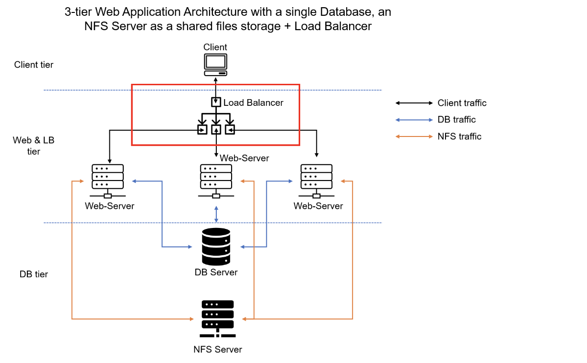
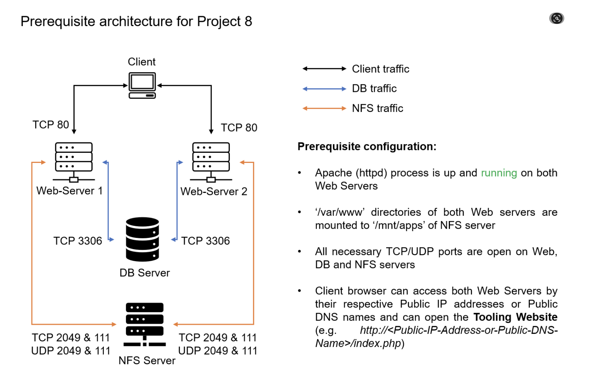
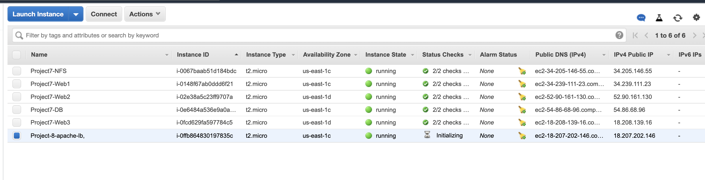
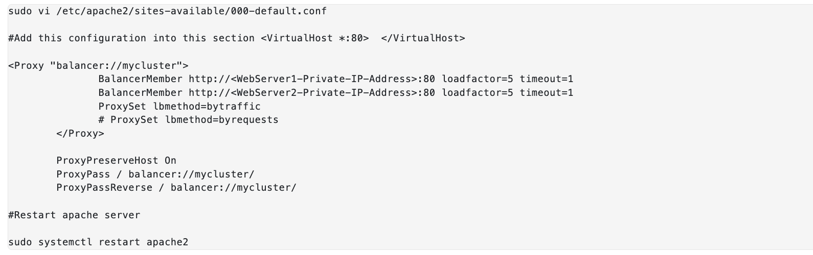
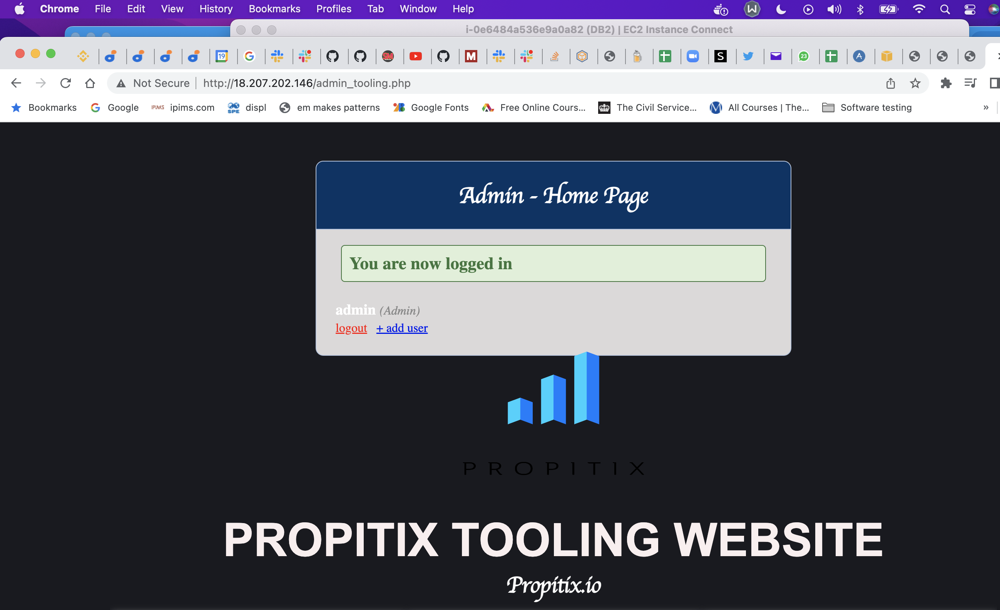
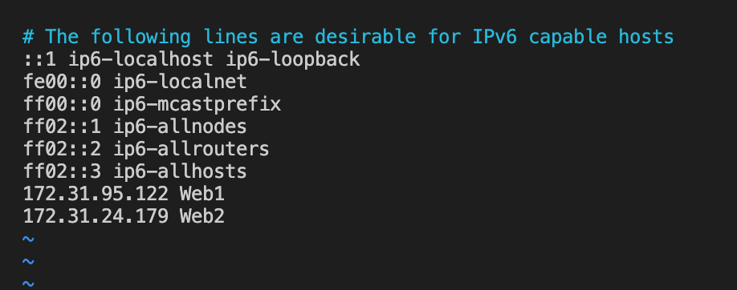
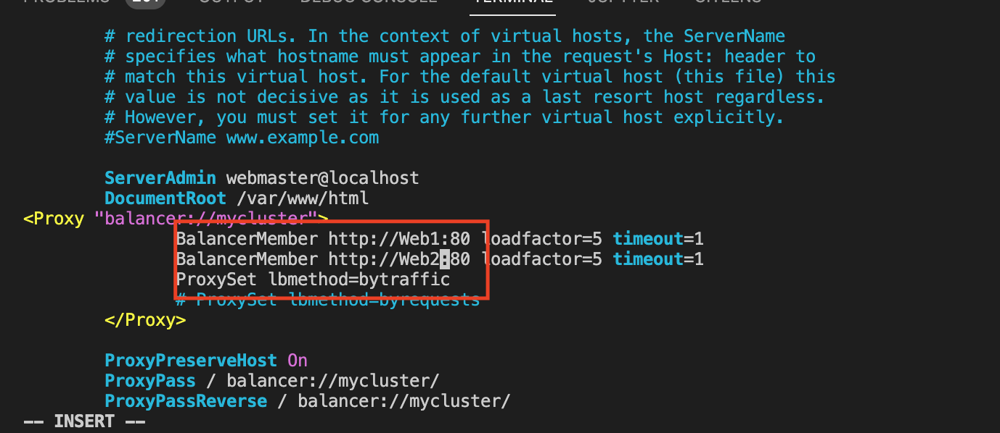
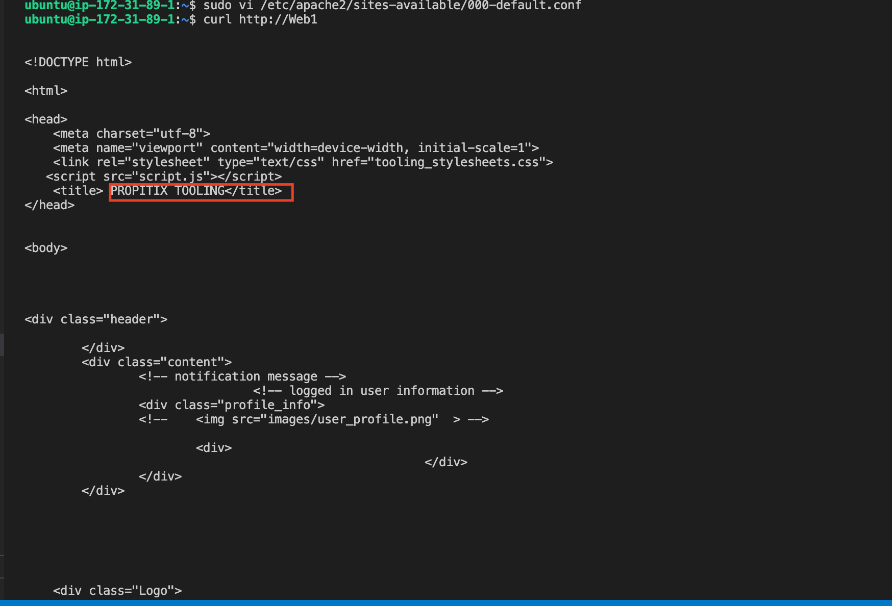
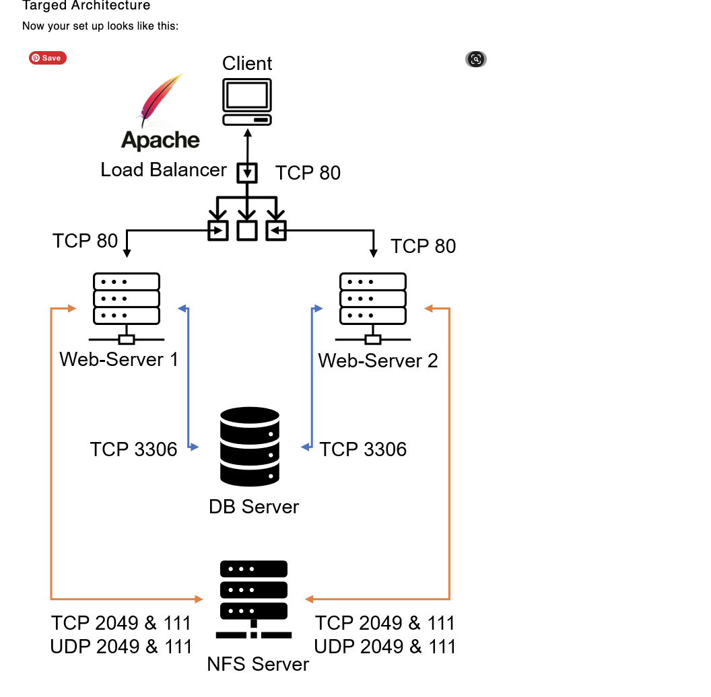

## LOAD BALANCER SOLUTION WITH APACHE

When a website is being accessed by millions of users a day, it becomes impossible to server all users using a single webserver (same is applicable to databases)

When you have just one Web server and load increases – you want to serve more and more customers, you can add more CPU and RAM or completely replace the server with a more powerful one – this is called "vertical scaling". This approach has limitations – at some point you reach the maximum capacity of CPU and RAM that can be installed into your server.

Another approach used to cater for increased traffic is `"horizontal scaling"` – distributing load across multiple Web servers. This approach is much more common and can be applied almost seamlessly and almost infinitely (you can imagine how many server Google has to serve billions of search requests).

In our set up in Project-7 we had 3 Web Servers and each of them had its own public IP address and public DNS name. A client has to access them by using different URLs, which is not a nice user experience to remember addresses/names of even 3 server, let alone millions of Google servers.

In order to hide all this complexity and to have a single point of access with a single public IP address/name, a Load Balancer can be used. A Load Balancer (LB) distributes clients’ requests among underlying Web Servers and makes sure that the load is distributed in an optimal way

This is what the new architechture will look like with the load balancer:

In this project we will enhance our Tooling Website solution by adding a Load Balancer to disctribute traffic between Web Servers and allow users to access our website using a single URL.

### Task
Deploy and configure an Apache Load Balancer for Tooling Website solution on a separate Ubuntu EC2 intance. Make sure that users can be served by Web servers through the Load Balancer

ENSRUE THE PREQUISITES ARE IN PLACE FOR PROJECT 8 TO WORK especiall the HTTPD service is running

### CONFIGURE APACHE AS A LOAD BALANCER

1. Create an Ubuntu Server 20.04 EC2 instance and name it `Project-8-apache-lb`, Below are the EC2 instances to be used for this project:

2. Ensure TCP pore 80 is open for this newly created instance unser inbound rules 

3. Install Apache Load Balancer on Project-8-apache-lb server and configure it to point traffic coming to LB to both Web Servers:

#Install apache2

`sudo apt update`
`sudo apt install apache2 -y`
`sudo apt-get install libxml2-dev`

#Enable following modules:

`sudo a2enmod rewrite`
`sudo a2enmod proxy`
`sudo a2enmod proxy_balancer`
`sudo a2enmod proxy_http`
`sudo a2enmod headers`
`sudo a2enmod lbmethod_bytraffic`

#Restart apache2 service

`sudo systemctl restart apache2`

The next step now is to configure load balancing by copying by pasting below into the file  using VI editor (ensure this is pasted into virtual host):

`sudo vi /etc/apache2/sites-available/000-default.conf`

Ensure you restart apache server

`sudo systemctl restart apache2`

bytraffic balancing method will distribute incoming load between your Web Servers according to current traffic load. We can control in which proportion the traffic must be distributed by loadfactor parameter.

You can also study and try other methods, like: bybusyness, byrequests, heartbeat

4. Verify that our configuration works – try to access your LB’s public IP address or Public DNS name from your browser:

NOTE THAT WHILST PASTING BELOW, you will need to replace the private IP addresses of the two webservers before saving the file

`http://<Load-Balancer-Public-IP-Address-or-Public-DNS-Name>/index.php`

Below shows the web browser result for the load balancer:

Note: If in the Project-7 you mounted `/var/log/httpd/` from your Web Servers to the NFS server – unmount them and make sure that each Web Server has its own log directory. You can do this by running the following code in the two webservers:

` sudo umount -f /var/log/httpd`

Open two ssh/Putty consoles for both Web Servers and run following command:

`sudo tail -f /var/log/httpd/access_log`

Running above command on the 2 webservers will logs attempts by external addresses trying to access the webserver

Try to refresh your browser page http://<Load-Balancer-Public-IP-Address-or-Public-DNS-Name>/index.php several times and make sure that both servers receive HTTP GET requests from your LB – new records must appear in each server’s log file. The number of requests to each server will be approximately the same since we set loadfactor to the same value for both servers – it means that traffic will be disctributed evenly between them.

If you have configured everything correctly – your users will not even notice that their requests are served by more than one server.

Side Self Study:
Read more about different configuration aspects of Apache mod_proxy_balancer module. Understand what sticky session means and when it is used.

### Optional Step – Configure Local DNS Names Resolution

Sometimes it is tedious to remember and switch between IP addresses, especially if you have a lot of servers under your management.
What we can do, is to configure local domain name resolution. The easiest way is to use `/etc/hosts file`, although this approach is not very scalable, but it is very easy to configure and shows the concept well. So let us configure IP address to domain name mapping for our LB.

#Open this file on your LB server:

`sudo vi /etc/hosts`

#Add 2 records into this file with Local IP address and arbitrary name for both of your Web Servers. (ensure to replace the private ip addresses of the webservers below before saving the file)

<WebServer1-Private-IP-Address> Web1
<WebServer2-Private-IP-Address> Web2

Now you can update your LB config file with those names instead of IP addresses. 

Again, open the load balancer config file with the code below:

`sudo vi /etc/apache2/sites-available/000-default.conf`

Replace the previously entered priavate IP addresses of the two webservers with web1 and web2 per below: 

BalancerMember http://Web1:80 loadfactor=5 timeout=1
BalancerMember http://Web2:80 loadfactor=5 timeout=1

Note that this is a local DNS name resolution so it applies only to this load balancer. It cannot be accessed by other servers or even from the internet. 

You can try to curl your Web Servers from LB locally (on the terminal ) using `curl http://Web1` or `curl http://Web2` – it shall work. You will see the HTML version of the tooling websites

Below is a snapshot of the results from running the curl command. Its the HTML version of the tooling website

This means the local name resolution works!

Remember, this is only internal configuration and it is also local to your LB server, these names will neither be ‘resolvable’ from other servers internally nor from the Internet.

This is what the architechture of the websites now looks like:

